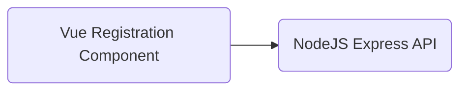

# Desafio MB Web

Somos a maior plataforma de negociação de criptomoedas e ativos alternativos da América Latina, criada para elevar a experiência de quem vivencia essa revolução, entregando o melhor serviço de negociação de ativos alternativos, com liberdade, segurança e liquidez. Sendo assim, nós existimos para mudar a maneira como as pessoas lidam com o dinheiro através da tecnologia.

## Objetivo

Esse desafio tem como objetivo entender seus conhecimentos sobre a plataforma Web, assim como conceitos de base como HTML, CSS, protocolo HTTP e arquitetura cliente/servidor.

## Projeto

Criar uma aplicação cliente/servidor de cadastro de usuários.

## Características da aplicação cliente

### Requisitos funcionais

O formulário de cadastro deve ser exibido em 4 passos distintos conforme apresentado abaixo:

**Passo 1**

Campos solicitados: 

- Endereço de e-mail.
- Tipo de cadastro: Pessoa Física (PF) ou Pessoal Jurídica (PJ)

Botões de ação

- **Continuar**: deve levar o usuário ao passo 2 do cadastro.

Validação: Deve-se validar se todos os campos foram preenchidos.

**Passo 2**

Nesse passo, dependendo do tipo de cadastro escolhido, deve-se renderizar os campos da seguinte forma:

Campos solicitados para o cadastro PF:

- Nome
- CPF
- Data de nascimento
- Número de telefone

Campos solicitados para o cadastro PJ:

- Razão social
- CNPJ
- Data de abertura da empresa
- Telefone

Botões de ação:

- **Voltar**: deve levar o usuário de volta ao passo 1 do cadastro.
- **Continuar**: deve levar o usuário ao passo 3 do cadastro.

Validação: Deve-se validar se todos os campos foram preenchidos.

**Passo 3**

Campos solicitados:

- Senha de acesso

Botões de ação:

- **Voltar**: deve levar o usuário de volta ao passo 2 do cadastro.
- **Continuar**: deve levar o usuário ao passo 4 do cadastro.

Validação: Deve-se validar se todos os campos foram preenchidos.

**Passo 4**

Esse passo consiste em permitir que o usuário revise todas as informações dadas e para isso é necessário que se apresente todos os campos dos passos anteriores, permitindo assim a revisão e possível alteração de quaisquer campo pelo usuário.

Botões de ação:

- **Voltar**: deve levar o usuário de volta ao passo 3 do cadastro.
- **Cadastrar**: deve submeter todos os dados informados pelo usuário ao serviço backend.

Validação: Deve-se validar se todos os campos foram preenchidos.

-----------

## Características da aplicação servidor

A aplicação servidor deve ser responsável por renderizar o formulário e receber a submissão dos dados ao final do cadastro.

### Endpoints

`[GET] /registration`

- Responsável por renderizar um html simples que irá carregar o componente de renderização do formulário.

