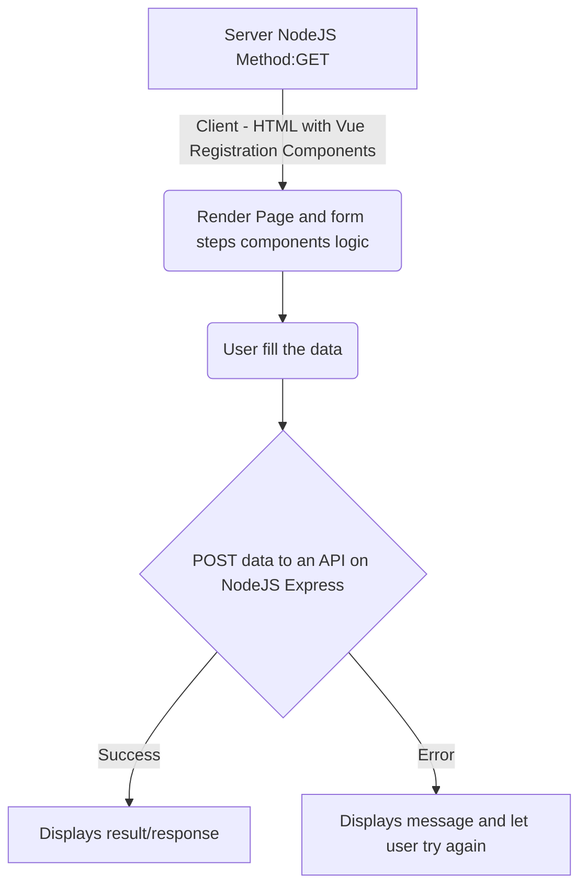

# Desafio MB Web

Somos a maior plataforma de negociação de criptomoedas e ativos alternativos da América Latina, criada para elevar a experiência de quem vivencia essa revolução, entregando o melhor serviço de negociação de ativos alternativos, com liberdade, segurança e liquidez. Sendo assim, nós existimos para mudar a maneira como as pessoas lidam com o dinheiro através da tecnologia.

* [Objetivo](#objetivo)
* [Características da aplicação cliente](#características-da-aplicação-cliente)
  * [Layout](#-layout)
  * [Requisitos funcionais](#-layout)
* [Características da aplicação servidor](#características-da-aplicação-servidor)
  * [Endpoints](#endpoints)
  * [Requisitos técnicos para o servidor NodeJS](#requisitos-técnicos-para-o-servidor-nodejs)
* [Dicas](#-dicas)

## Objetivo

Esse desafio tem como objetivo em nos ajudar a entender seus conhecimentos sobre a plataforma Web, as linguagens, conceitos de base de Javascript, HTML, CSS, protocolo HTTP,  comunicação entre cliente (browser/app) e servidor/APIs e como você constrói a solução técnica com base nos requisitos apresentados.

## Projeto

Criar uma aplicação cliente (browser) de cadastro de usuários que envia os dados para um servidor NodeJS via uma API.

### 👌 Requisitos técnicos para a aplicação

- VueJS 3 (via composition API com `<script setup>` + Vite) / Javascript Vanilla (não utilize Typescript)
- Não é necessário utilizar Vue Router ou frameworks do tipo
- Não utilize frameworks de Store/Gerenciamento de estado, dê preferência a recursos nativos da framework Vue ou do Javascript Vanilla
- Não utilize frameworks para requisições HTTP como Axios e similares, dê preferência ao fetch nativo
- **Não utilize ferramentas de IA** para gerar o código, queremos entender como você escreve o código, pensa e desenvolve as soluções. Código gerado por IA pode atrapalhar a análise da sua capacidade técnica.
- CSS/SASS desenvolvidos por você apenas (não utilize Tailwind, Vuetify ou outras frameworks de estilo, queremos entender como você estrutura classes e seus nomes, estilos, elementos e nomenclatura das variáveis)
- Performance no client-side é importante, leve isso em consideração ao construir sua solução, tanto em download dos assets, bem como na execução do código e uso de recursos de processamento e memória.
- NodeJS com Express para servir o conteúdo e as APIs (com modo "mockup") descritos abaixo na sessão [Requisitos técnicos para o servidor NodeJS](#requisitos-técnicos-para-o-servidor-nodejs)
- Utilize npm para gerenciamento e instalação de dependências e scripts necessários

# Características da aplicação cliente

### 🎨 Layout

Utilize a imagem abaixo como referência de estilo para os componentes de formulário.

### Requisitos funcionais

O formulário de cadastro deve ser exibido em 4 passos distintos e modulares conforme apresentado abaixo, com capacidade de ser responsivo para telas de celulares.

# **Passo 1**

**Campos de formulário**

- Endereço de e-mail.
- Tipo de cadastro: Pessoa Física (PF) ou Pessoa Jurídica (PJ)

**Botões de ação**

- Continuar: (Ação) -> Levar o usuário ao passo 2 do cadastro.

**Validação**

Validar se todos os campos foram preenchidos e de acordo com o tipo de campo, por exemplo, validar formato de e-mail.

# **Passo 2**

Nesse passo, dependendo do tipo de cadastro escolhido, deve-se renderizar os campos da seguinte forma:

**Campos de formulário para o cadastro PF**

- Nome
- CPF
- Data de nascimento
- Número de telefone

**Campos de formulário para o cadastro PJ**

- Razão social
- CNPJ
- Data de abertura da empresa
- Telefone

**Botões de ação**

- Voltar: `Ação` -> levar o usuário de volta ao passo 1 do cadastro.
- Continuar: `Ação` -> levar o usuário ao passo 3 do cadastro.

**Validação**

Validar se todos os campos foram preenchidos e de acordo com o tipo de campo, por exemplo, validar se a data de abertura/nascimento é uma data válida.

# **Passo 3**

**Campos de formulário**

- Senha de acesso

**Botões de ação**

- Voltar: `Ação` ->  levar o usuário de volta ao passo 2 do cadastro.
- Continuar: `Ação` -> levar o usuário ao passo 4 do cadastro.

**Validação**

Validar se todos os campos foram preenchidos.

# **Passo 4**

Esse passo consiste em permitir que o usuário revise todas as informações dadas e para isso é necessário que se apresente todos os campos dos passos anteriores, permitindo assim a revisão e possível alteração de quaisquer campos pelo usuário e consequente validação pelo código antes do envio do cadastro.

**Botões de ação**

- Voltar: `Ação` -> levar o usuário de volta ao passo 3 do cadastro.
- Cadastrar: `Ação` -> submeter todos os dados informados pelo usuário a api de cadastro.

**Validação**

Validar se todos os campos foram preenchidos e de acordo com o tipo de campo se estão no formato correto.

---

---

# Características da aplicação servidor

Aplicação básica responsável por renderizar o formulário e receber a submissão dos dados ao final do cadastro. Não é necessário armazenar os dados. A aplicação não precisa ser complexa, use o módulo Express para o NodeJS para criar um endpoint (API) para receber os dados simulando apenas que eles serão salvos. O objetivo é ter apenas 2 endpoints simples.

### Endpoints

`[GET] /registration`

- Responsável por renderizar uma página html simples que irá carregar os componentes do formulário no browser.

`[POST] /registration`

- Api de cadastro responsável por receber os dados submetidos pelo usuário em formato JSON e responder para o client com sucesso. O objetivo é apenas simular envio do formulário com os dados preenchidos, o recebimento da resposta e como será feito o envio para servidor.

**Validação**

Validar antes de receber os dados se todos os campos foram preenchidos, caso não, retorne um erro com o código http adequado.

---

### Requisitos técnicos para o servidor NodeJS

- Express/Javascript Vanilla (não utilize Typescript)

---

> ## 🏆 Dicas
> 
> - Não é necessário que o componente de formulário seja renderizado no servidor (server-side rendering).
> - O POST dos dados submetidos não precisa armazenar os dados em nenhum banco de dados, apenas receber os dados, validar de forma básica se foram enviados e simular a resposta de um cadastro com sucesso para o navegador com um objeto JSON.
> - Não iremos avaliar a fidelidade do layout apresentado, não é preciso investir tempo no “pixel perfect” para esse caso.
> - Apresente a sua implementação completa em um único repositório e com instruções do README.md de como rodar/testar a aplicação

## 📄 Importante

Esse código não será usado em nenhuma hipótese para qualquer fim a não ser o de avaliação de conhecimentos técnicos.
