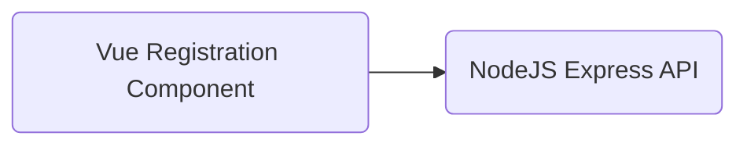

# Desafio MB Web

Somos a maior plataforma de negociação de criptomoedas e ativos alternativos da América Latina, criada para elevar a experiência de quem vivencia essa revolução, entregando o melhor serviço de negociação de ativos alternativos, com liberdade, segurança e liquidez. Sendo assim, nós existimos para mudar a maneira como as pessoas lidam com o dinheiro através da tecnologia.

## Objetivo

Esse desafio tem como objetivo entender seus conhecimentos sobre a plataforma Web, assim como conceitos de base como HTML, CSS, protocolo HTTP e arquitetura cliente/servidor.

## Projeto

Criar uma aplicação cliente/servidor de cadastro de usuários.

## Características da aplicação cliente

### Requisitos funcionais

O formulário de cadastro deve ser exibido em 4 passos distintos conforme apresentado abaixo:

> **Passo 1**

**Campos de formulário**

- Endereço de e-mail.
- Tipo de cadastro: Pessoa Física (PF) ou Pessoa Jurídica (PJ)

**Botões de ação**

- Continuar: levar o usuário ao passo 2 do cadastro.

**Validação**

Validar se todos os campos foram preenchidos.

> **Passo 2**

Nesse passo, dependendo do tipo de cadastro escolhido, deve-se renderizar os campos da seguinte forma:

**Campos de formulário para o cadastro PF**

- Nome
- CPF
- Data de nascimento
- Número de telefone

**Campos de formulário para o cadastro PJ**

- Razão social
- CNPJ
- Data de abertura da empresa
- Telefone

**Botões de ação**

- Voltar: levar o usuário de volta ao passo 1 do cadastro.
- Continuar: levar o usuário ao passo 3 do cadastro.

**Validação**

Validar se todos os campos foram preenchidos.

> **Passo 3**

**Campos de formulário**

- Senha de acesso

**Botões de ação**

- Voltar: levar o usuário de volta ao passo 2 do cadastro.
- Continuar: levar o usuário ao passo 4 do cadastro.

**Validação**

Validar se todos os campos foram preenchidos.

> **Passo 4**

Esse passo consiste em permitir que o usuário revise todas as informações dadas e para isso é necessário que se apresente todos os campos dos passos anteriores, permitindo assim a revisão e possível alteração de quaisquer campo pelo usuário.

**Botões de ação**

- Voltar: levar o usuário de volta ao passo 3 do cadastro.
- Cadastrar: submeter todos os dados informados pelo usuário a api de cadastro.

**Validação**

Validar se todos os campos foram preenchidos.

### Layout

Utilize a imagem abaixo como base de estilo para os componentes de formulário.

### Requisitos técnicos

- Vue/Javascript (não utilize Typescript)
- Css/Sass (não utilize Tailwind)

## Características da aplicação servidor

A aplicação servidor responsável por renderizar o formulário e receber a submissão dos dados ao final do cadastro.

### Endpoints

`[GET] /registration`

- Responsável por renderizar um html simples que irá carregar os componentes do formulário.

`[POST] /registration`

- Api de cadastro responsável por receber os dados submetidos pelo usuário em formato JSON.

**Validação**

Validar antes de receber os dados se todos os campos foram preenchidos, caso não, retorne um erro com o código http adequado.

### Requisitos técnicos

- Express/Javascript (não utilize Typescript)

## Dicas

- Não é necessário que o componente de formulário seja renderizado no servidor (server side rendering).
- Não iremos avaliar a fidelidade do layout apresentado, não é preciso investir tempo no “pixel perfect” para esse caso.
- Apresente a sua implementação completa em um único repositório.

## Importante

Esse código não será usado em nenhuma hipótese para qualquer fim a não ser o de avaliação de conhecimentos técnicos.
